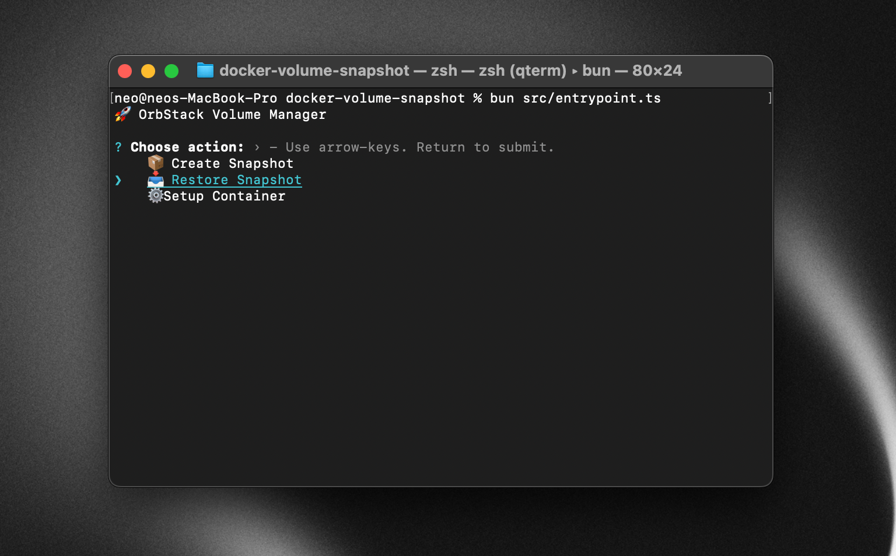

# OrbStack Volume Manager

Simple Interactive CLI tool for creating and restoring Docker volume snapshots using OrbStack's native export/import functionality.



## Usage

```bash
npm install -g docker-volume-snapshot

dvs
```

## Prerequisites

- [OrbStack](https://orbstack.dev/) installed and running
- Docker containers with named volumes

## Installation

```bash
bun install
```

## Usage

```bash
bun src/entrypoint.ts
```

### Commands

**Setup Container** - Configure container/volume pairs for easy snapshot management
**Create Snapshot** - Export volume to compressed `.tar.zst` archive  
**Restore Snapshot** - Import archive back to volume (overwrites existing data)

## Configuration

Configurations are stored as JSON in `~/.orbstack-volume-manager/config.json`:

```json
{
  "configs": {
    "my-app": {
      "CONTAINER": "my-app",
      "VOLUME": "my-app-data"
    }
  }
}
```

## Snapshots

Snapshots are saved to `~/orbstack-snapshots/` as compressed `.tar.zst` files with automatic timestamped names or custom filenames.

## Architecture

```
src/
├── commands/           # Core operations
├── helpers/
│   ├── cli/           # OrbStack & Docker CLI wrappers  
│   └── tui/           # Terminal UI utilities
├── types/             # TypeScript interfaces
└── entrypoint.ts      # Main CLI interface
```
